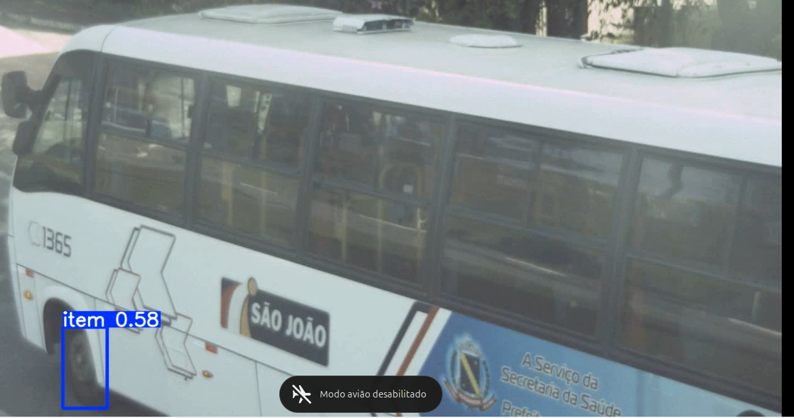

# Testes Iniciais com o Modelo YOLOv11 para Segmentação de Veículos

## Introdução

Foram realizados testes preliminares utilizando o modelo **YOLOv11**, com foco em **segmentação de veículos**. As avaliações consideraram diferentes câmeras, horários (diurno e noturno) e níveis de zoom.

**Referência técnica**: [Ultralytics – Instance Segmentation and Tracking](https://docs.ultralytics.com/guides/instance-segmentation-and-tracking/)  
**Classes do modelo**: [Gist com classes YOLOv11](https://gist.github.com/rcland12/dc48e1963268ff98c8b2c4543e7a9be8)

---

## Configuração dos Testes

### Câmeras e Condições

Foram avaliadas três câmeras, com diferentes configurações e horários:

1. **Câmera 1 (`cam06_08_2025`)**
   - Modo diurno (sem zoom)
   - Modo diurno (com zoom)
   - Modo noturno

2. **Câmera 2 (`cam05_08_2025`)**
   - Modo diurno (sem zoom)
   - Modo noturno (sem zoom)

3. **Câmera 3 (`megapixel1636x1220`)**
   - Modo diurno (com zoom médio)

---

## Resultados

### Desempenho Geral

O modelo foi, em sua maioria, capaz de identificar e segmentar veículos de forma adequada. No entanto, apresentou dificuldade em manter o **tracking** de veículos (i.e., reconhecer o mesmo veículo em diferentes frames), especialmente em **cenários com zoom** e com veículos de grande porte como **ônibus** e **caminhões**.

- Em **zoom médio (Câmera 3)**, o desempenho foi superior em comparação com o zoom máximo.
- As **câmeras sem zoom** apresentaram melhor estabilidade na segmentação e rastreamento, o que é essencial para contabilizar corretamente elementos como **rodas e eixos**.

### Confusão entre classes

Houve confusão entre categorias como **carros**, **vans**, **jipes**, **ônibus** e **caminhões**, como ilustrado na imagem abaixo (figura 1):

**Figura 1 – Confusão entre carro e caminhão**  

---

### Análise por Condição

#### Iluminação Noturna

- O modelo apresentou **desempenho muito abaixo do esperado** à noite.
- Em muitos casos, a detecção falhou completamente ou apresentou **confiança inferior a 1%**.
- O melhor resultado foi quando um veículo foi iluminado pelo farol de outro carro, permitindo sua detecção (figura 2):

**Figura 2 – Carro detectado durante o período noturno**  

#### Iluminação e Angulação

- A iluminação gerou ruído na detecção em diversos momentos.
- Ajustes na **angulação das câmeras** e no **nível de zoom** são recomendados para melhorar os resultados, principalmente para contabilizar as rodas de cada veículo.

**Figura 3 – Ônibus não detectado corretamente**  

**Figura 4 – Detecção de caminhão (Câmera 1)**  

**Figura 5 – Detecção incompleta de caminhão**  

**Figura 6 – Desempenho da Câmera 3 (zoom médio)**  

**Figura 7 – Caminhão não sendo detectado**  

**Figura 8 – Ônibus identificado como carro**  

---

## Próximos Passos

- Realizar **testes com modelos especializados em segmentação de rodas** (previsto para sexta-feira).
- Avaliar a viabilidade de **treinar modelos próprios** utilizando os datasets de referências.
- Aplicar **fine-tuning** no modelo atual para melhorar a precisão em diferentes tipos de veículos.
- Aprimorar o **módulo de tracking**.
- Capturar múltiplas imagens por veículo e manter a de **maior confiança**.
- Implementar contagem de **rodas/eixos** para caminhões e ônibus.
- Realizar novos testes em **diferentes cenários**, com aplicação de **métricas de validação**.
- **Finalizar o modelo** com base nos resultados.

---

## Parte 2: Testes com modelos de identificação de rodas

Na segunda etapa do estudo e desenvolvimento inicial do projeto, foi realizada a implementação de um modelo pré-treinado voltado para a detecção e identificação de rodas, com foco inicial em veículos de porte leve, como automóveis e motocicletas. Durante a fase experimental, observou-se que o modelo também foi capaz de detectar rodas em veículos pesados, como caminhões e ônibus, conforme ilustrado nas imagens a seguir:

Entretanto, o modelo apresentou limitações, especialmente na detecção simultânea de múltiplas rodas em uma mesma imagem, resultando em falhas de contagem, como exemplificado abaixo:

O cenário ideal, encontrado em bases públicas de referência, apresenta detecções mais robustas e precisas, conforme demonstrado nas imagens:

Além disso, foi realizada uma análise do consumo computacional durante a aplicação do modelo. Para um vídeo de 3 minutos, o tempo total de processamento foi aproximadamente equivalente à duração do vídeo, com um uso médio de memória da GPU em torno de 245 MB, conforme evidenciado na figura a seguir:

## Referências de Datasets

🔗 [Car and Truck Detection Dataset (Roboflow)](https://universe.roboflow.com/stage-dt/car-and-truck-detection/dataset/3/images?split=train)  
🔗 [Segmentação de Rodas](https://universe.roboflow.com/afit/wheel-segmentation-diytc/dataset/4)  
🔗 [Segmentação de Rodas de Caminhão](https://universe.roboflow.com/truck-1pjoz/wheel-xtdjd/browse?queryText=&pageSize=50&startingIndex=0&browseQuery=true)  
🔗 [Heavy Vehicles Detection](https://universe.roboflow.com/spcv-lab-iitt-1-lqfoq/heavy-vehicle-detection-qiop2/browse?queryText=&pageSize=50&startingIndex=0&browseQuery=true)
